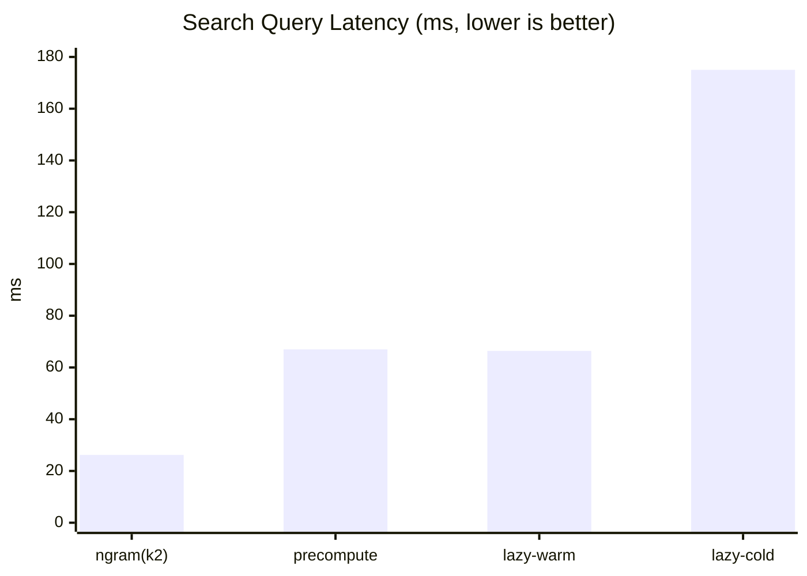

# swift-hangul

`swift-hangul`은 iOS/macOS용 한글 처리 및 검색 최적화 Swift 패키지입니다.

## 패키지 구성

- `HangulCore`
  - 한글 분해/조합
  - 초성 추출
  - 받침/조사 처리
  - 키보드(한/영) 변환
  - 숫자 한글화, 발음 표준화, 로마자 변환

- `HangulSearch`
  - `HangulCore` 기반 검색 인덱스
  - 초성/원문 검색 (`contains`, `prefix`, `exact`)
  - 전략: `precompute`, `lazyCache`, `ngram(k:2|3)`
  - 유사어 스코어링(편집거리, jaccard, 키보드 근접, 자모 유사도)
  - async 검색 취소/텔레메트리

## Requirements

- Swift 6.0+
- iOS 15+
- macOS 14+

## Installation (SwiftPM)

```swift
dependencies: [
    .package(url: "https://github.com/hyunggu/swift-hangul.git", from: "1.0.0")
]
```

```swift
.product(name: "HangulCore", package: "swift-hangul")
.product(name: "HangulSearch", package: "swift-hangul")
```

## Quick Start

### HangulCore

```swift
import HangulCore

Hangul.disassemble("값")              // "ㄱㅏㅂㅅ"
Hangul.disassemble("ㅘ")              // "ㅗㅏ"
Hangul.assemble(["ㄱ","ㅏ","ㅂ","ㅅ"]) // "값"
Hangul.getChoseong("프론트엔드")       // "ㅍㄹㅌㅇㄷ"
Hangul.hasBatchim("값")                // true
```

### HangulSearch

```swift
import HangulSearch

struct Keyword: Sendable {
    let id: Int
    let name: String
}

let index = HangulSearchIndex(
    items: [
        Keyword(id: 1, name: "프론트엔드"),
        Keyword(id: 2, name: "백엔드"),
        Keyword(id: 3, name: "네이버"),
    ],
    keyPath: \.name,
    policy: .init(indexStrategy: .precompute, cache: .lru(capacity: 512))
)

let direct = index.search("프론트", mode: .contains)
let choseong = index.search("ㅍㄹㅌ", mode: .contains)
let similar = index.searchSimilar("vmfhsxmdpsem")
```

## 간단 성능 지표

측정 환경: Apple Swift 6.2.4, arm64, macOS 26.3.1, 데이터 60,000개

| Metric | Mean (ms) |
| --- | ---: |
| `Core.getChoseong` | 7.1 |
| `Core.disassemble` | 19.6 |
| `Core.assemble` | 58.9 |
| `Search.query-ngram(k2)` | 26.2 |
| `Search.query-precompute` | 67.0 |
| `Search.query-lazyCache-warm` | 66.4 |
| `Search.query-lazyCache-cold` | 175.0 |



유사도 평가(내장 평가셋): `top1=1.000`, `top3=1.000`, `mrr=1.000`

## Packaging Note

- `Examples/HangulSampleApp`는 샘플 앱이며, SwiftPM 라이브러리 타겟에는 포함되지 않습니다.
- SwiftPM 제품은 `HangulCore`, `HangulSearch` 두 개만 노출됩니다.

## Credits

- 아이디어/기능 범주는 [`es-hangul`](https://github.com/toss/es-hangul)을 레퍼런스로 설계했습니다.
- 본 프로젝트는 Swift/iOS/macOS 환경에 맞춘 별도 구현입니다.

## License

이 프로젝트는 [MIT License](LICENSE)를 따릅니다.

참고: `es-hangul`의 라이선스/저작권은 원저작자 저장소 정책을 따릅니다.
